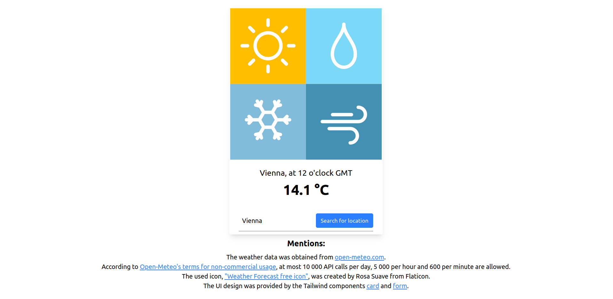

# daily-weather-forecast

**Daily Weather Forecast** - a web application that offers, for a given city, the temperature in degree Celsius at the current time in GMT.

# Technical details

- Requirements: Java 21, npm 10.9.1, Docker (Desktop)
- Running the application using two terminals with the Docker daemon running in the background:
	- Inside the "daily-weather-forecast-backend" directory: run `./mvnw spring-boot:run`  
	- Inside the "daily-weather-forecast-frontend": run `ng serve`
The app can be accessed at http://localhost:4200/.
	
# Mentions

- The weather data was obtained from [open-meteo.com](https://open-meteo.com/).
- According to [Open-Meteo's terms for non-commercial usage](https://open-meteo.com/en/terms), at most 10 000 API calls per day, 5 000 per hour and 600 per minute are allowed.
- The image used for the UI was [created by Rosa Suave and taken from Flaticon](https://www.flaticon.com/free-icon/weather-forecast_9176568?term=weather&page=1&position=25&origin=search&related_id=9176568).
- The designs of the Tailwind components for [cards](https://v1.tailwindcss.com/components/cards#stacked) and [forms](https://v1.tailwindcss.com/components/forms#underline-form) were reused when creating the UI.
